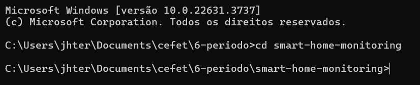
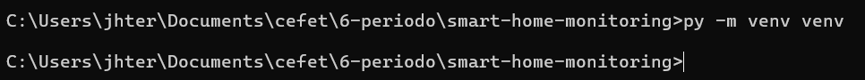
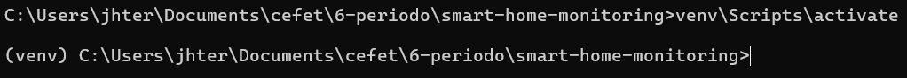

# Iniciando um projeto em Python
Esta etapa tem por objetivo informar sobre a criação da venv para iniciar o projeto.

# Venv:

## 1° O que é venv?
Venv é um ambiente virtual que permite isolar as bibliotecas do projeto das demais instaladas no sistema. Isso garante que as dependências do projeto não conflitem com outras versões de bibliotecas instaladas globalmente.

## 2° Criação/Iniciação da Venv

### 1 - Iniciando a Venv
Vá em seu terminal e abra no `cmd` a pasta que contém seu projeto em Python

**OBS:** Recomendo usar o cmd durante todo o processo ao invés do PowerShell



Digite no terminal o seguinte código para criar a Venv:

```
py -m venv venv
```



Agora no seu terminal digite o seguinte código para ativar a Venv:

```
venv\Scripts\activate
```



Caso você tenha feito tudo certo irá aparecer na esquerda do seu diretório `(venv)` indicando que a venv está ativa

# Baixando bibliotecas

## 1° O que são as bibliotecas:
As bibliotecas em Python são coleções de módulos que contêm funções, classes e variáveis que podem ser usadas para realizar tarefas específicas sem a necessidade de escrever código do zero. Elas servem para facilitar e acelerar o desenvolvimento de software, fornecendo ferramentas prontas para resolver problemas comuns e específicos.

## 2° Baixando
Baixe as bibliotecas que serão utilizadas no projeto. Para baixar basta usar o código abaixo (Não esqueça de conferir se a Venv está criada)

```
py -m pip install nome_biblioteca
```

# Criando o arquivo requirements.txt
Este tópico mostrará como criar o arquivo requirements.txt através do cmd. O requirements.txt conterá todas as bibliotecas presentes na venv com suas respectivas versões.

## 1° Código para listar as bibliotecas presentes na venv
```
python -m pip freeze
```

## 2° Código para criar o arquivo automaticamente
```
python -m pip freeze > requirements.txt

```